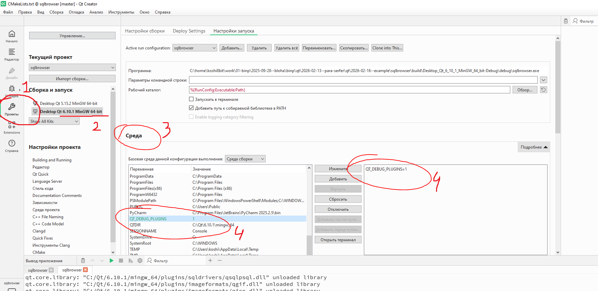

# Qt + SQL Postgres

## Запуск

В проекте представлен пример работы с SQL БД Postgres на MinGW

Для работы нужно положить DLL рядом с `*.exe` из папки `./dll/*` (возможно там есть лишние dll, читай далее)

## DLL

Проблема: нужны dll для работы с БД. Для каждой БД нужна своя dll.
dll Postgres можно скачать с офф сайта, но он скомпилен MSVC, а не MinGW

В итоге dll можно получить двумя способами

### Скомпилить из сорцов (сложно)

Ну тут я хз, ёбс 2 дня, не победил.
Толкового мануала не нашел, кроме как [этот](https://youtu.be/3CnAxGgvEmo?si=tbso9vaQtKcAkloq). Но там через `qmake`, а я использую CMake 6.10.1

### MSYS2 (изи)
https://www.msys2.org

Установить в папку по умолчанию
```
C:\msys64\
```

<details>
<summary>Возможно выполнить это (я не делал)</summary>

```
pacman -Syu
```

Окно может закрыться — это нормально.

Открой снова MSYS2 MSYS и снова:
```
pacman -Syu
```

Обновление должно завершиться полностью.

</details>

Качаем бинарники. Запустить `C:\msys64\msys2.exe`
```
pacman -S mingw-w64-x86_64-postgresql
```

Должны появиться `*.dll` в папке ниже, их положить рядом с `*.exe`
```
C:\msys64\mingw64\bin
```

Вроде как нужны только эти файлы, но лично мне их не хватило, я положил все `*.dll` к своему бинарнику и заработало

```
libssl-3-x64.dll
libcrypto-3-x64.dll
zlib1.dll
libgcc_s_seh-1.dll
libstdc++-6.dll
libwinpthread-1.dll
```

## Отладка

Для отладки того, что загружено, а что нет нужно добавить флаг на этапе компила из картинки ниже
```
QT_DEBUG_PLUGINS=1
```

